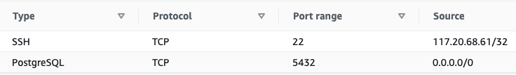
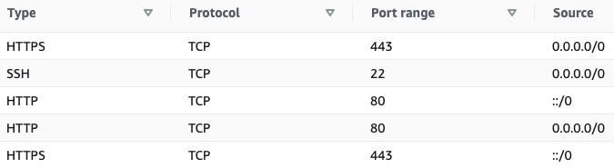

# Part 1: Setting up a Database EC2

## Step A: Security Groups
Because we want requests to be able to reach our cloud instances, we need to open them up at least a little bit. If we crack them wiiiiide open, though, we're making them less secure. The solution is AWS security groups, which we've looked at in the past.

There are various different configurations that are viable, but today we'll create two separate groups, one for each of our EC2 instances.

Log into the AWS management console, search for "Security Groups", and create:

### 1: One group called `flask-database-group` with rules as follows:



(This sets it up so that any apps we create can hit our database for data from anywhere in the world, and also so that we, specifically, can SSH in in order to set the database up.)

### 2: Another group called flask-site-group with rules like so:



This lets us SSH in, and also access the site from a browser.

---

## Step B: The Database EC2
Jump to the EC2 dashboard and create a new free-tier instance running Ubuntu. Make sure that you store your .pem file, and assign it to the flask-database-group. It helps to give it a useful tag too, so that you can find it again if you have lots of EC2 instances.

Next we have some quality-of-life stuff to do:

### 1: Find your `.pem` file, and move it to the `~/.ssh` directory:

```
mv my-key.pem ~/.ssh/my-key.pem
```

### 2: Give access to the .pem file:

```
cd ~/.ssh
```
```
chmod 0400 my-key.pem
```

### 3: Add a nifty bit of ssh configuration to your machine to make it easy to ssh into this VM. 

Open the `~/.ssh/config` file in an editor and add the following to it:

```
Host flask-database
   Hostname IP_OF_INSTANCE_HERE
   User ubuntu
   IdentityFile ~/.ssh/NAME_OF_PEM_FILE.pem
   IdentitiesOnly yes
```

This lets you ssh into the instance by simply typing: 

```
ssh flask-database
```

Handy!

---

## Step C: Set Up The Database
Now that we can access our instance, we need to set up a PostgreSQL database on it.

SSH in, and the run the following commands:

```
sudo apt-get update -y && sudo apt-get upgrade -y
```

```
sudo apt install postgresql -y
```

```
sudo su postgres
```

```
psql -U postgres -c "CREATE USER ubuntu WITH PASSWORD 'insert_password_here';"
```

```
psql -U postgres -c "CREATE DATABASE insert_db_name_here;"
```

```
psql -U postgres -c "GRANT ALL PRIVILEGES ON DATABASE insert_db_name_here TO ubuntu;"
```

```
exit
```

## Step D: Open The Database to Requests
Now we need to configure PostgreSQL to listen for commands coming from outside the EC2 instance.

```
sudo nano /etc/postgresql/12/main/postgresql.conf
```

Find the line beginning with `listen_addresses`, and change it to read:

```
listen_addresses = '*'                  # what IP address(es) to listen on;
```

Exit the editor with `ctrl-x`. Select `y` to save your changes. Postgres will now listen to requests arriving at the EC2 from outside. We also need to let those requests be authenticated though, so run the following command to open the necessary config file...

```
sudo nano /etc/postgresql/12/main/pg_hba.conf
```

... and add these two lines to the end of the file:

```
host    all             all             0.0.0.0/0               md5
host    all             all             ::/0                    md5
```

Finally, restart the Postgres server:

```
sudo systemctl restart postgresql
```

## Step E: Connect The Database to Your Local Flask App
We will dive into deploying the app logic tomorrow. For now, let's make sure our locally hosted app can connect to our cloud-based database. This should be familiar. We need to:

* Clone down the app code to our local machine
* Create a virtual environment for it
* Install the requirements
* Create a `.env` file and add the following lines to it...

```
DB_USER="ubuntu"
DB_PASS="your_password_here"
DB_NAME="database_name_here"
DB_DOMAIN="database_public_IP_here:5432"
SECRET_KEY="some secret string"
```

If everything is working correctly, you should be able to set up and run the app by running:

```
flask db-custom create
```
```
flask db-custom seed
```
```
flask run
```
Tada!

[Now let's set up the app on another EC2](./app_instance.md)