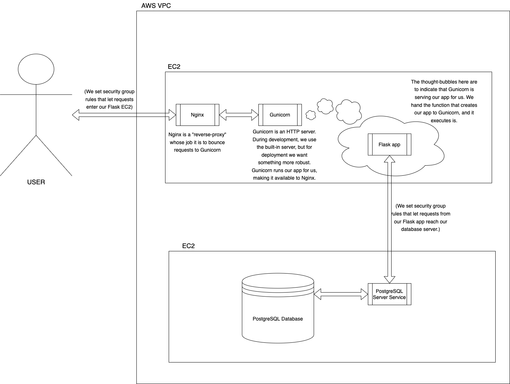

# The Goal

Today we are going to begin a run-through of setting up a deployed flask app on AWS. We'll be aiming at a relatively simple client-server style architecture, with:

* one EC2 instance running a database
* one EC2 instance running the Flask app

[Here](https://github.com/Oliver-CoderAcademy/streets_app) is a link to the code we'll be using.

Today's lesson coverts the database deployment, and tomorrow we will look at the Flask app itself.

This architecture could easily be added to (for instance, we could include S3 bucket storage for image files, etc), but we will keep it simple for today. We've already looked at how to add S3 storage to a flask app, by the way, and that technique should mesh pretty seamlessly with what we're covering here.

It should be pointed out that the architecture we'll be exploring today and tomorrow is distinct from cloud-native style solutions that employ lots of micro-services/lambdas/other fancy tricks. If you're keen for that kind of content, look out for the return of JK on Saturday when he'll run through that!

[First, let's configure a database EC2.](./database.md)